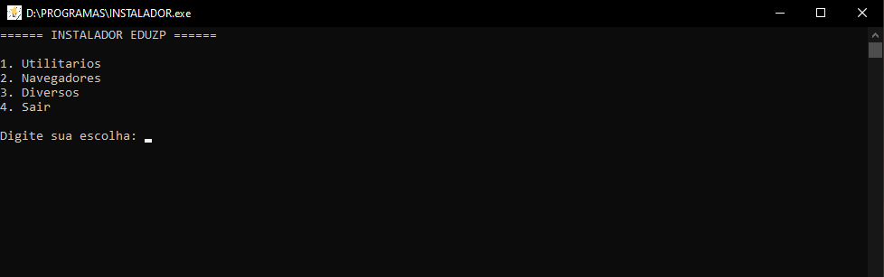

# ATIVADORES EDUZP



> FACILITAR A INSTALAÇÃO DE PROGRAMAS POPULARES EMPRESARIAIS OU PESSOAIS.

### Ajustes e melhorias

O projeto ainda está em desenvolvimento e as próximas atualizações serão voltadas para as seguintes tarefas:

- [x] Analisar programas mais usados
- [x] Buscar linguagem mais eficiente para o projeto
- [x] Instalar sem precisar de mais de um programa
- [x] Otimizar o código
- [ ] Adicionar novos programas
- [ ] Adicionar interface gráfica e interativa

## 💻 Pré-requisitos

Antes de começar, verifique se você atendeu aos seguintes requisitos:

- Não possui o programa ou versão anterior instalada em caso de erro.
- Possuir suporte para execução dos arquivos.

## 🚀 Como Usar

Para instalar, siga estas etapas:

```
Baixe o arquivo, execute e selecione a instalação desejada.
```

## 📝 Licença

Esse projeto está sob licença. Veja o arquivo [LICENÇA](LICENSE.md) para mais detalhes.
